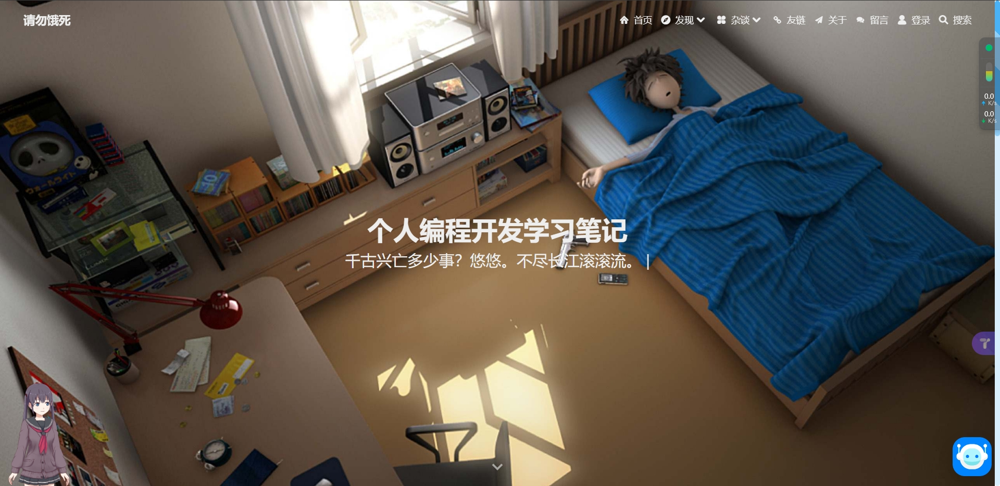

<center>
    <h1> 基于Springboot + Vue 开发的前后端分离博客 </h1>
</center>

​     


## 博客介绍

<p >
    本博客是参考 [风丶宇] 博客更新而成，感谢大佬提供的页面，然后定制新增部分功能，是个非常值得新手入门学习的Java规范化编程案例！
</p>
## 简介

走一步，按一下回车！


## 在线地址

**项目链接：** [https://www.todayishappen.cn/](https://www.macw.cc)

**后台链接：** [blog.todayishappen.cn](https://blog.macw.cc)


**Gitee地址：** 暂无

**在线接口文档地址：** 暂无

您的star是我坚持的动力，感谢大家的支持，欢迎提交pr共同改进项目。

## 更新内容
- 更新博客图片为接口自动刷新获取
- 说说首页滚动框优化，截取第一行前n个字符展示
- 优化部分页面样式，新增部分自动化接口调用
- 首页右下角新增[摸鱼日历]接口等
- 后台系统配置更新
- 添加个人网盘菜单
- 点赞功能更新为无需登录点赞，通过cookie刷新记录
- 游客头像取消默认黑白，改为自动刷新
- 友链页面优化，添加博客地址说明等
- 新增文章发布页添加文章附件功能
- 添加谷歌广告
- 添加博客首页天气标签
- 添加百度收录
- 添加CSDN爬虫导入文章
- 博客文章页面，可以添加附件功能


## 后续更新计划
- 添加微信公众号菜单配置功能
- 博客首页多主题配置等
- 其他问题收集中，欢迎博客页留言

敬请期待。。。。。。。。。。。。。。。。。。


## 系统目录结构

前端项目位于blog-vue下，blog为前台，admin为后台。

后端项目位于blog-springboot下。

SQL文件位于根目录下的blog-mysql8.sql，需要MYSQL8以上版本。

可直接导入该项目于本地，修改后端配置文件中的数据库等连接信息，项目中使用到的关于阿里云功能和第三方授权登录等需要自行开通。

当你克隆项目到本地后可使用邮箱账号：admin@qq.com，密码：1234567 进行登录，也可自行注册账号并将其修改为admin角色。


**ps：请先运行后端项目，再启动前端项目，前端项目配置由后端动态加载。** 

```
blog-springboot
├── annotation    --  自定义注解
├── aspect        --  aop模块
├── config        --  配置模块
├── constant      --  常量模块
├── consumer      --  MQ消费者模块
├── controller    --  控制器模块
├── dao           --  框架核心模块
├── dto           --  dto模块
├── enums         --  枚举模块
├── exception     --  自定义异常模块
├── handler       --  处理器模块（扩展Security过滤器，自定义Security提示信息等）
├── service       --  服务模块
├── strategy      --  策略模块（用于扩展第三方登录，搜索模式，上传文件模式等策略）
├── util          --  工具类模块
└── vo            --  vo模块
```

## 项目特点

- 前台参考"Hexo"的"Butterfly"设计，美观简洁，响应式体验好。
- 后台参考"element-admin"设计，侧边栏，历史标签，面包屑自动生成。
- 采用Markdown编辑器，写法简单。
- 评论支持表情输入回复等，样式参考Valine。
- 添加音乐播放器，支持在线搜索歌曲。
- 前后端分离部署，适应当前潮流。
- 接入第三方登录，减少注册成本。
- 支持发布说说，随时分享趣事。
- 留言采用弹幕墙，更加炫酷。
- 支持代码高亮和复制，图片预览，深色模式等功能，提升用户体验。
- 搜索文章支持高亮分词，响应速度快。
- 新增文章目录、推荐文章等功能，优化用户体验。
- 新增在线聊天室，支持撤回、语音输入、统计未读数量等功能。
- 新增aop注解实现日志管理。  
- 支持动态权限修改，采用RBAC模型，前端菜单和后台权限实时更新。
- 后台管理支持修改背景图片，博客配置等信息，操作简单，支持上传相册。
- 代码支持多种搜索模式（Elasticsearch或MYSQL），支持多种上传模式（OSS或本地），可支持配置。
- 代码遵循阿里巴巴开发规范，利于开发者学习。

## 技术介绍

**前端：** vue + vuex + vue-router + axios + vuetify + element + echarts

**后端：** SpringBoot + nginx + docker + SpringSecurity + Swagger2 + MyBatisPlus + Mysql + Redis + elasticsearch + RabbitMQ + MaxWell + Websocket

**其他：** 接入QQ，微博第三方登录（暂隐藏），接入腾讯云人机验证、websocket

## 运行环境

**服务器：** 腾讯云2核4G CentOS7.6

**CDN：** 阿里云全站加速

**对象存储：** 阿里云OSS

这套搭配响应速度非常快，可以做到响应100ms以下。

**最低配置：** 1核2G服务器（关闭ElasticSearch）

## 开发环境

|开发工具|说明|
|-|-|
|IDEA|Java开发工具IDE|
|VSCode|Vue开发工具IDE|
|Navicat|MySQL远程连接工具|
|Another Redis Desktop Manager|Redis远程连接工具|
|X-shell|Linux远程连接工具|
|Xftp|Linux文件上传工具|

|开发环境|版本|
|-|-|
|JDK|1.8|
|MySQL|8.0.20|
|Redis|6.0.5|
|Elasticsearch|7.9.2|
|RabbitMQ|3.8.5|

## 项目截图




## 快速开始

### 项目配置

详见文章[项目配置教程](http://www.todayishappen.cn/articles/61)


**提别推荐：使用宝塔部署更为方便！！！**

## 注意事项

- 项目拉下来运行后，可到后台管理页面网站配置处修改博客相关信息.
- 邮箱配置，第三方授权配置需要自己申请。
- ElasticSearch需要自己先创建索引，项目运行环境教程中有介绍。

## 项目总结

博客作为新手入门项目是十分不错的，项目所用的技术栈覆盖的也比较广，适合初学者学习。主要难点在于权限管理、第三方登录、websocket这块。做的不好的地方请大家见谅，有问题的或者有好的建议可以私聊联系我。

欢迎各位大佬发邮箱进行博客问题沟通，也欢迎各位去博客留言页进行留言，每一条留言我都会认真看并且回复，感谢支持！！！


